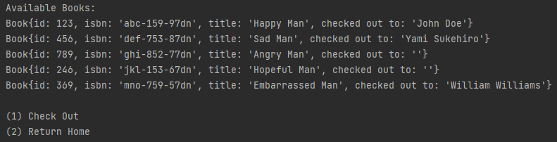

# Neighborhood Library

The library is a free service to anyone in the neighborhood. 
Anyone can check out a book, they just enter their name and the
application will track who checked it out. To check in a book 
the application will ask for the specified id of the returning
book.

## Screens

**1. Home Screen**

 

_Prompts the user to choose the Show Available Books method 
or the Show Checked Out Books method._

##

**2. Show Available Books**



_Displays all library books and properties. Prompts the user to either check out a book or return home._

##

**3. Show Checked Out Books**


_Displays all current checked out books and prompts the user to check in or return home._

## Interesting Code
```            
                switch(selection) {
                case 1:
                    System.out.println("\nAvailable Books:");
                    showAvailableBooks(scan);
                    break;
                case 2:
                    System.out.println("\nChecked Out Books:");
                    showCheckedOutBooks(scan);
                    break;
                case 3:
                    System.out.println("\nGoodbye.");
                    return;
                default:
                    System.out.println("Invalid Response");
                }
```
_I found this piece of code to be interesting because I realized that the program spends majority of its time running in this one section._


